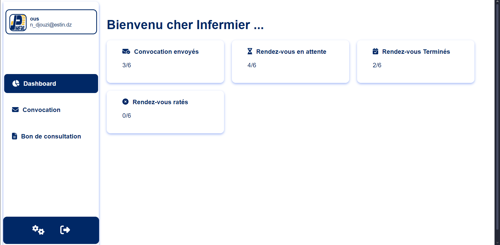
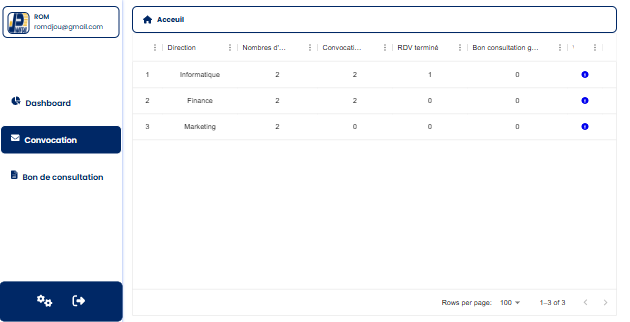
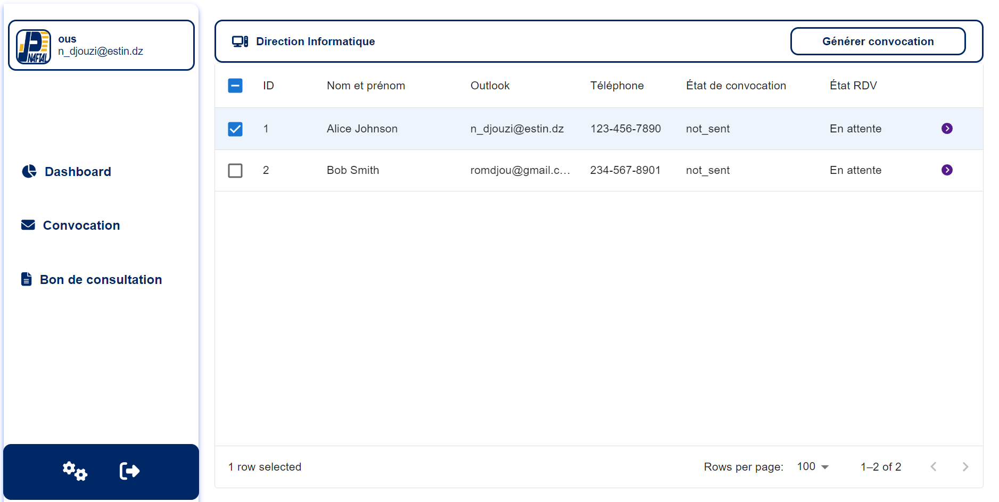
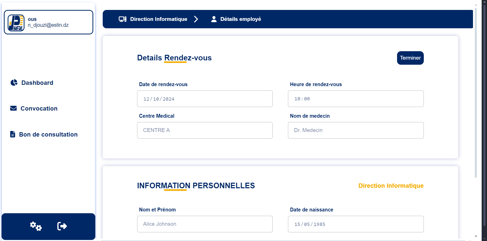
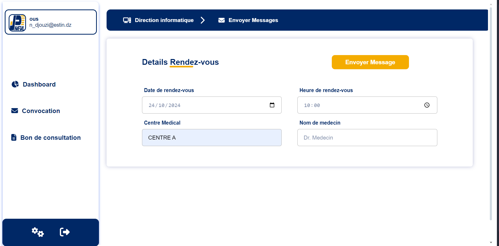
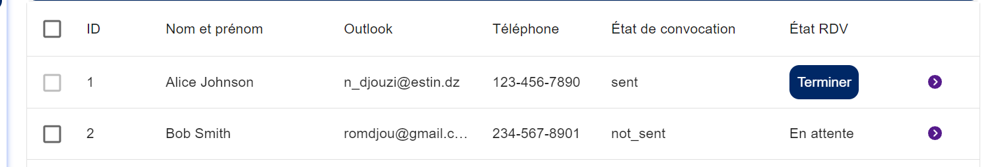
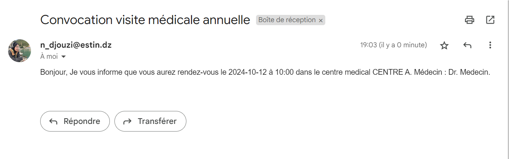
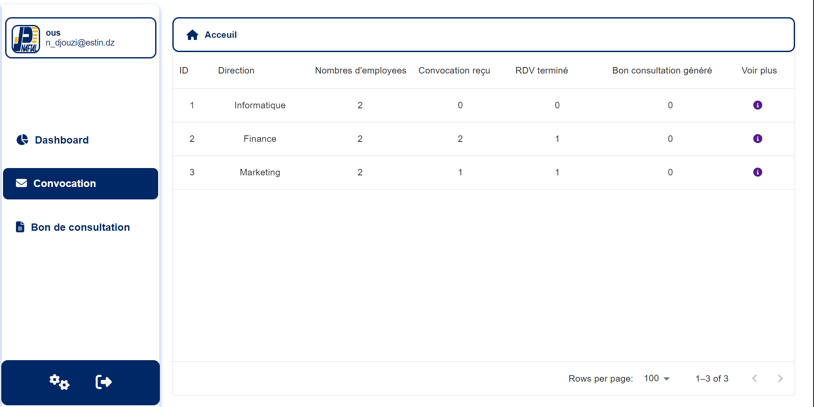
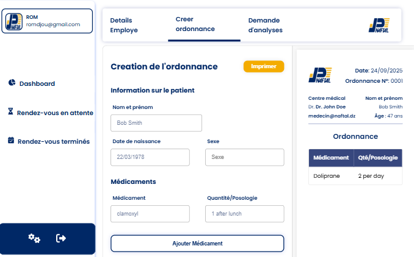

# Naftal – Annual Medical Visit Management System

A full-stack web application developed during my internship at **Naftal** to manage annual medical visits for company employees.  
The system allows administrators, nurses, and doctors to coordinate convocations, track appointment statuses, and manage medical visit data efficiently.

---

## 🚀 Features

- **Role-based Access**
  - Administrator - Nurse: Generate and send convocations, track employee attendance.
  - Doctor: Update medical visit results, generate medical prescription, check emplye details.
  - Gestionnaire: View employee data and reports 'not finished yet'.

- **Convocation Management**
  - Generate convocations for selected employees.
  - Automatic email notifications for appointments.
  - Track convocation status (sent / not sent).

- **Medical Appointment Tracking**
  - Update visit status: pending, completed, or missed.
  - View statistics for each department (direction).

- **Dynamic Dashboard**
  - Real-time statistics (total employees, convocations sent, completed visits).
  - Data visualizations for better monitoring.

- **Multi-direction Support**
  - Manage employees grouped by department.
  - Drill-down view for each department's employees.

---

## 🛠️ Tech Stack

**Frontend:**  
- React.js  
- Axios (API calls)  
- SCSS / Material UI (for styling)  

**Backend:**  
- Node.js + Express.js  
- JWT Authentication & Role-based Authorization  
- Nodemailer (email service)  

**Database:**  
- MySQL (with phpMyAdmin for management)


## 📸 Screenshots

### Authentification


### Dashboard Admin - Nurse -


### Convocation Management
### company's Services

### Employees per Service

### One emplyee details

### Convocation form


### state changes after sending email


### Email Notification


### Doctors' dashboard


### List of appointments

### prescription generation


---

## 📦 Installation & Setup

1. **Clone the repository**
   ```bash
   git clone https://github.com/romidj/Naftal-Internship-Annual-Medical-Visit-Management-System.git
   cd Naftal-Internship-Annual-Medical-Visit-Management-System


